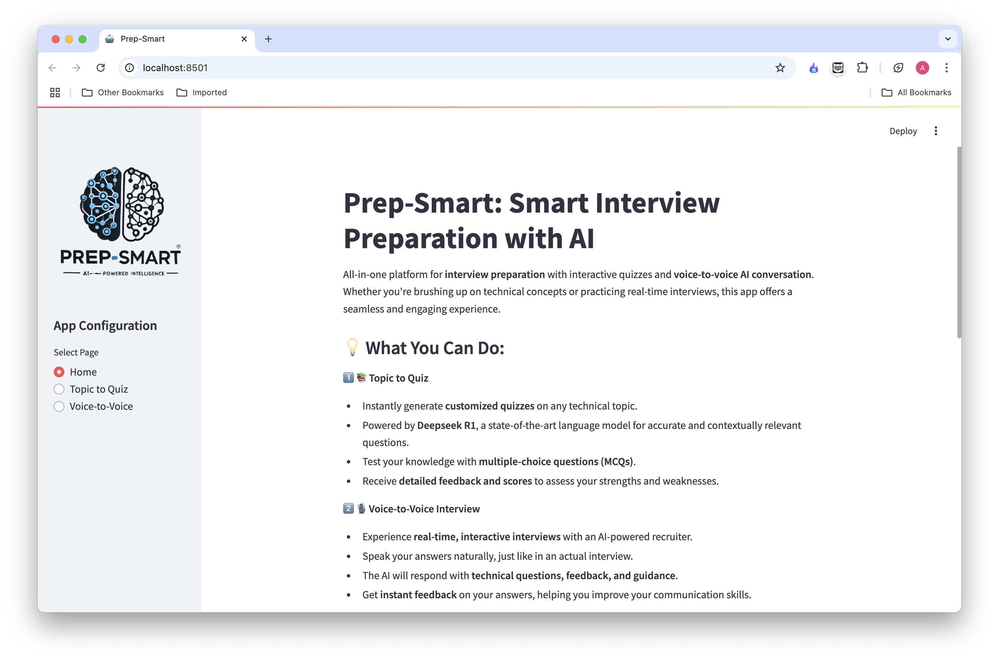
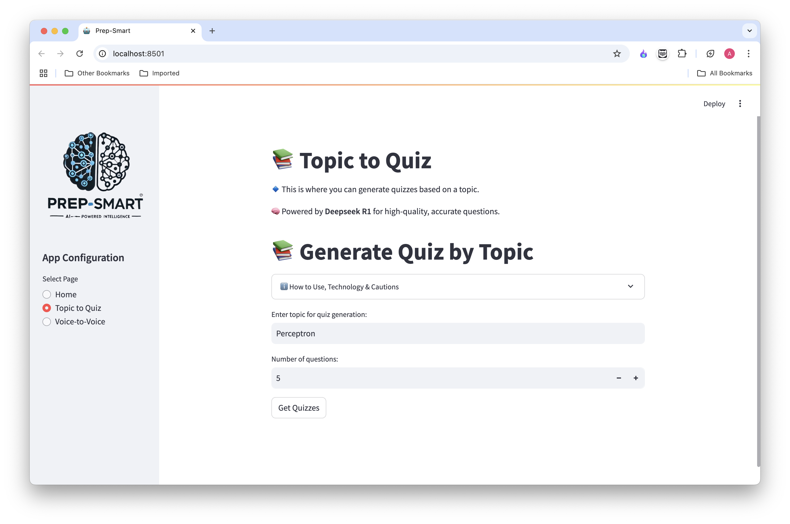
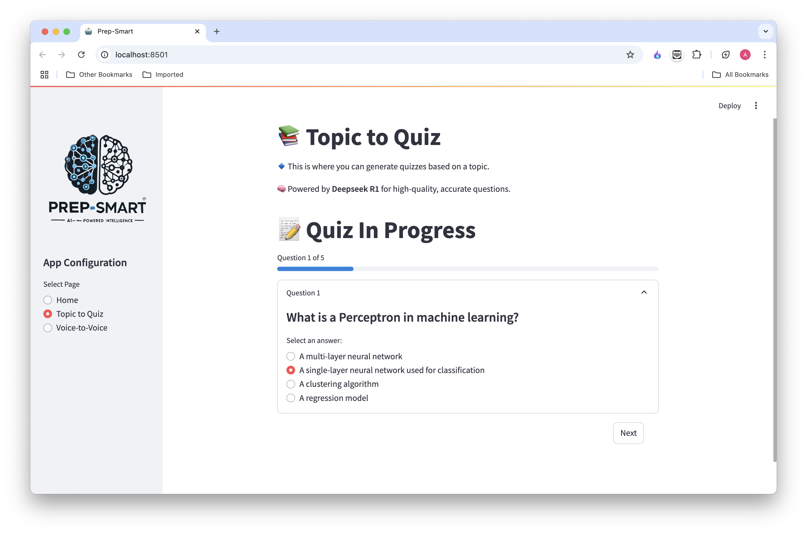
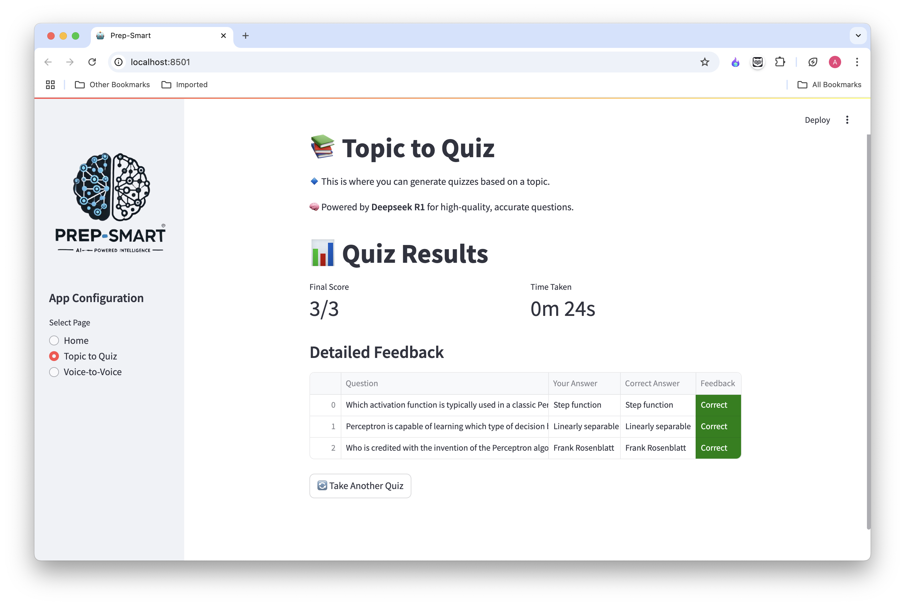
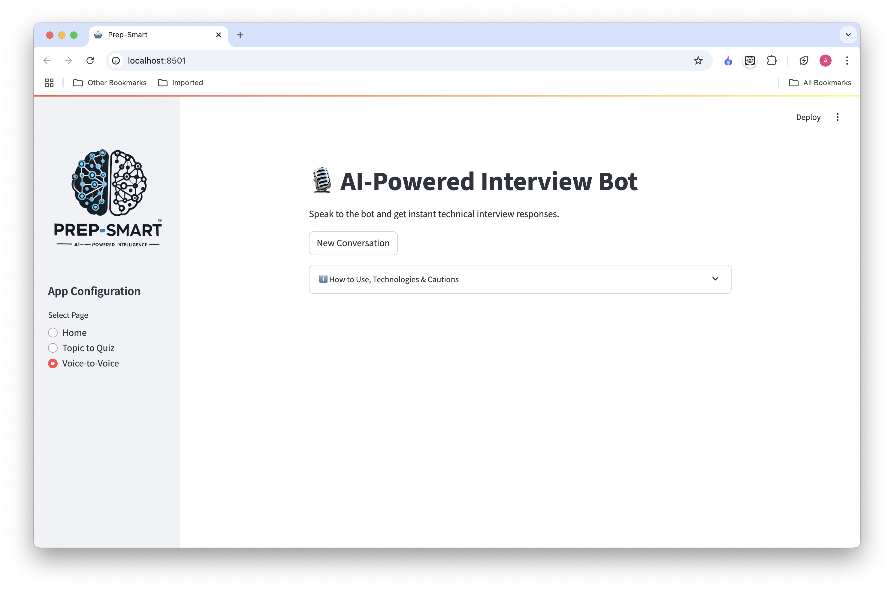
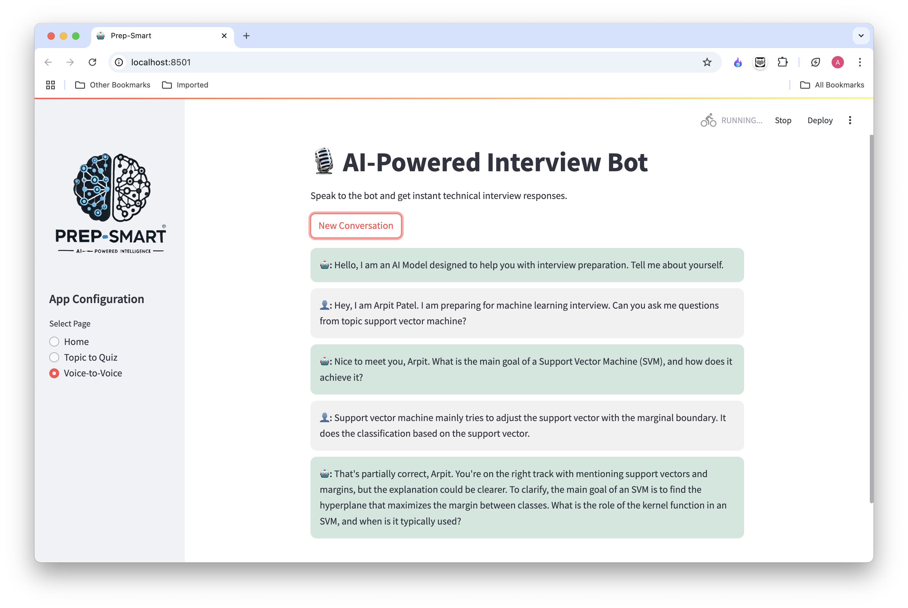

# 📚 **Prep-Smart: Smart Interview Preparation with AI**
<div align="center">
  
</div>

### 🚀 **Empower your interview preparation with AI-powered quizzes and real-time voice-to-voice interactions.**

---

## ⚙️ **Project Description**
Prep-Smart is a **Streamlit-based web application** designed to help users **prepare for technical interviews**. It offers:
- **Interactive Quizzes:** Generate customized quizzes on any technical topic using **Deepseek R1** LLM.
- **Voice-to-Voice Interviews:** Engage in real-time, interactive interview conversations with **speech-to-text (STT)**, **LLM-generated questions**, and **text-to-speech (TTS)** responses.
- **Parallel Processing:** The app handles parallel transcription, LLM response generation, and TTS playback using multithreading for a seamless experience.
<div align="center">
  
</div>
---
<div align="center">
  
</div>
----
<div align="center">
  
</div>
---
<div align="center">
  
</div>
<div align="center">
  
</div>
---
<div align="center">
  
</div>
---
<div align="center">
  
</div>
---

## 🔥 **Key Features**
### 🧠 **1. Topic to Quiz**
- Generate **customized quizzes** on any technical topic.
- Powered by **Deepseek R1** for accurate, contextually relevant questions.
- **Multiple-choice questions (MCQs)** with instant feedback.
- **Score calculation** and detailed performance metrics.

### 🎙️ **2. Voice-to-Voice AI Interview**
- Simulate **real-time technical interviews**.
- **Speech-to-Text (STT)** using **Deepgram** for real-time transcription.
- **LLM (Groq)** generates interview-style responses with feedback.
- **Text-to-Speech (TTS)** plays back the AI's response in real-time.
- Continuous conversation until the user exits.

### ⚡ **3. Real-Time Display and Speech**
- Gradual display of text responses for a **natural reading experience**.
- Simultaneous speech synthesis for **lifelike AI interactions**.
- **Multithreading** ensures smooth and parallel processing.

---

## 🛠️ **Technologies Used**
### 🛠️ **Frontend**
- **Streamlit**: For building an interactive and user-friendly UI.

### 🛠️ **Backend**
- **Deepgram**: 
    - **Speech-to-Text (STT)** for real-time transcription.
    - **Text-to-Speech (TTS)** for lifelike AI responses.
- **Deepseek R1**: 
    - **LLM for generating quiz questions**.
- **Groq LLM**:
    - **Interview-style response generation**.
- **Multithreading**:
    - Ensures smooth parallel processing.

---

## 🚀 **Installation Instructions**

### ✅ **1. Clone the Repository**
```bash
git clone https://github.com/arpitpatelsitapur/PrepSmart.git
cd PrepSmart
```

### ✅ **2. Create a Virtual Environment**
```bash
# Using Python 3.10.12
python3.10 -m venv venv
source venv/bin/activate  # Linux/Mac
venv\Scripts\activate     # Windows
```

### ✅ **3. Install Dependencies**
```bash
# Install all required Python packages:
pip install -r requirements.txt
```

### ✅ **4. Environment Variables**
Create a `.env` file in the root directory with the following variables:
```
DEEPGRAM_API_KEY=YOUR_DEEPGRAM_API_KEY
GROQ_API_KEY=YOUR_GROQ_API_KEY
```

### ✅ **5. Configure Streamlit for Deployment**
Create a `runtime.txt` file with the following content:
```
python-3.10.12
```

### ✅ **6. Run the Application**
```bash
# Start the Streamlit app locally:
streamlit run app.py
```

---

## 🎯 **How to Use**

### 🧠 **1. Topic to Quiz**
- Select "Topic to Quiz" from the sidebar.
- Enter the topic you want to be quizzed on.
- The app generates MCQs using Deepseek R1.
- Answer the quiz and view your final score and feedback.

### 🎙️ **2. Voice-to-Voice AI Interview**
- Select "Voice-to-Voice" from the sidebar.
- Click the "New Conversation" button.
- Speak your answers naturally into the microphone.
- The AI will:
  - Transcribe your speech in real-time.
  - Generate questions and feedback using Groq LLM.
  - Speak the responses using Deepgram TTS.

---

## 📦 **Directory Structure**
```
/utils
 ├── app_logo.png         # Application logo
 ├── topic_page.py        # Functions for topic-based quiz
 ├── topic_to_quiz.py     # Quiz generation logic
.env                      # Environment variables file
requirements.txt          # Python dependencies
runtime.txt               # Python version for deployment
app.py                    # Main Streamlit app file
README.md                 # Project documentation
```

---

## ⚠️ **Cautions & Troubleshooting**
- **Microphone Issues**: Ensure proper mic configuration for STT.
- **Slow Responses**: Check internet stability during LLM and TTS API calls.
- **Streamlit Crashes**: Refresh the page if the app becomes unresponsive.
- **API Rate Limits**: Be mindful of Deepgram and Groq API rate limits during heavy usage.

---

## 🚀 **Deployment**

### ✅ **Deploy on Streamlit Cloud**
1. Create a new Streamlit Cloud app.
2. Upload the entire project repository.
3. Add environment variables in secrets:
   - DEEPGRAM_API_KEY
   - GROQ_API_KEY
4. Specify the Python version using runtime.txt.
5. Deploy the app.

---

## 👥 **Contributors**
- Arpit Patel – ML and AI Engineer Enthusiast
- Contributions are welcome! Feel free to submit a pull request.

---

## ⭐ **Future Enhancements**
- **Question Bank**: Save and manage quizzes for later practice.
- **User Authentication**: Enable login and user history.
- **Enhanced Feedback**: Provide more detailed question explanations.
- **Performance Optimization**: Optimize STT and TTS latency.

---

## 📧 **Contact**

For any queries or contributions, feel free to reach out:
- Email: arpit.patel@example.com
- LinkedIn: Arpit Patel

---

## 🛡️ **License**

This project is licensed under the MIT License. Feel free to modify and distribute it.
